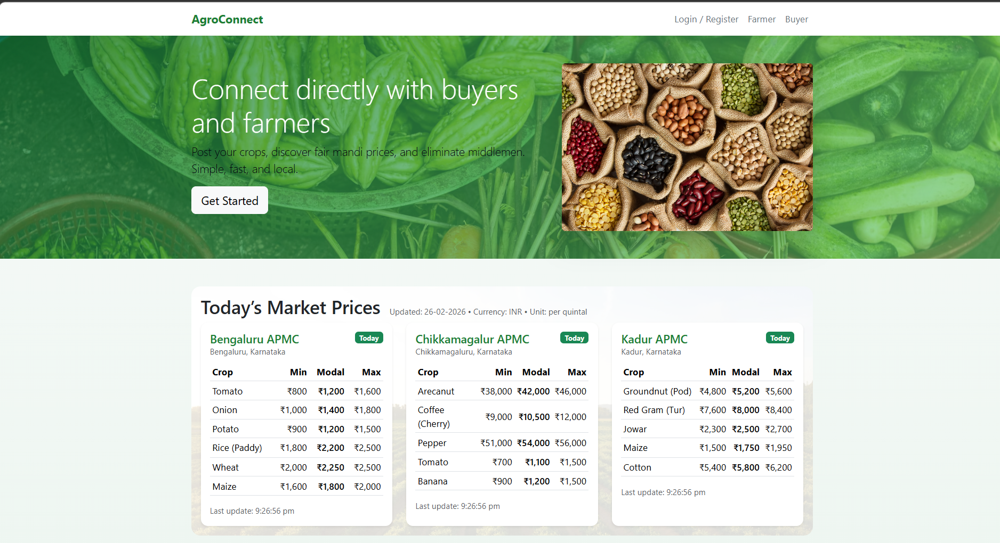

# AgroConnect

Simple mini project to connect farmers and buyers. This scaffold includes a Node.js + Express backend, MongoDB models, and minimal static frontend pages.

## Features
- Farmer and Buyer registration/login (JWT-based authentication)
- Farmers can add crop listings
- Buyers can view listings and see farmer contact info (authenticated & logged)
- Sample market prices on the home page
- **Email verification** for buyers before viewing contact info
- **Contact data protection**: Only authenticated buyers can view farmer contact details
- **Audit logging**: All contact views are logged with buyer ID, timestamp, and IP
- **Rate limiting**: Contact endpoint limited to 10 requests per minute per user

## Security Features
- JWT token-based authentication
- Role-based access control (farmers can add crops, buyers can view contacts)
- Email verification required for buyers (with resend functionality)
- Contact information masked in public crop listings
- All contact views logged to ContactLog collection
- Rate limiting prevents abuse of contact endpoint
- Bcrypt password hashing
- Buyer reputation system and account blocking
- Admin dashboard for moderation
- CSV export of audit logs

## Quick Start

### 1. Install dependencies
```powershell
npm install
```

### 2. Create an .env file
Copy `.env.example` to `.env` and configure (or use in-memory DB for testing):
```powershell
$env:USE_INMEMORY_DB='true'
$env:JWT_SECRET='dev-secret'
$env:PORT='4000'
```

### 3. Start the server
```powershell
npm run dev
```

### 4. Open in browser
Navigate to http://localhost:4000

## Email Verification

**Important**: Buyers who register with an email must verify it before viewing farmer contact information.

📖 **See [VERIFICATION_GUIDE.md](./VERIFICATION_GUIDE.md) for complete instructions on:**
- How email verification works
- Where to find verification links (server console in dev mode)
- How to resend verification emails
- Troubleshooting verification issues

**Quick tip**: In development mode, verification links are printed to the server console. Simply copy and visit the link in your browser.

## Running without MongoDB (Demo Mode)

If you don't have MongoDB installed locally, you can run the app with an in-memory MongoDB server:

```powershell
$env:USE_INMEMORY_DB='true'; npm run dev
```

This uses `mongodb-memory-server` and keeps data in memory only for the running session.

## Dashboard Interface


